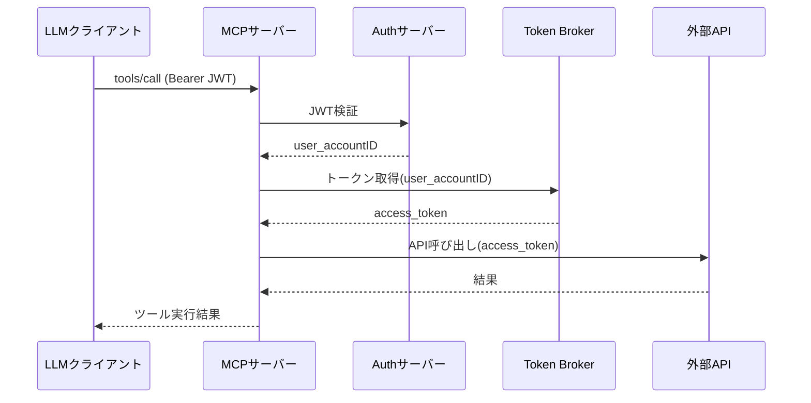
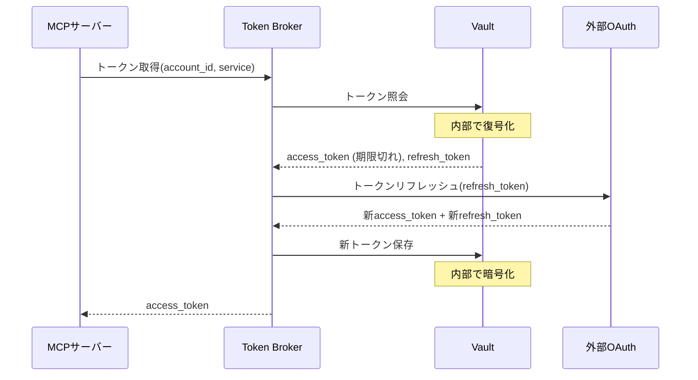

# MCPist システム仕様書（spec-sys）

本ドキュメントは、MCPistのシステム全体像とコンポーネント構成を定義する。

---

## ドキュメント管理情報

| 項目            | 値                                                                                                       |
| ------------- | ------------------------------------------------------------------------------------------------------- |
| Status        | `archived`                                                                                              |
| Version       | v1.0 (MEGA版)                                                                                            |
| Superseded by | [go-mcp-dev/dev/DAY3/specification/spec-sys.md](../../../go-mcp-dev/dev/DAY3/specification/spec-sys.md) |
| 差分概要          | go-mcp-dev版はMCPプロトコル2025-11-25対応、Tasks/Elicitation対応、ロールベース認可モデル採用                                      |

---

## バージョン情報

**現在の仕様バージョン: v1.0 (Phase 1: クラウド版)**

本仕様書は、MCPist Phase 1（クラウド版）の実装範囲を定義している。Phase 2（MCPist Desktop）の将来構想については、以下ADRを参照:
- [ADR-007: Host層を含めた完全ポータビリティの実現](./ADR-007-host-layer-portability.md)
- [ADR-008: LLM API抽象化層によるクライアント側ポータビリティ](./ADR-008-llm-api-abstraction.md)

### Phase 1の実装範囲

**対象:**
- MCPサーバー層の完全実装
- Tools/Resources/Promptsの3プリミティブ対応
- Token Brokerによる統一認証（Supabase版）
- 8モジュール（Notion, GitHub, Jira, Confluence, Supabase, Google Calendar, Microsoft Todo, RAG）

**対象外（Phase 2で実装）:**
- LLM API抽象化層
- MCPクライアント実装
- デスクトップUI
- Token BrokerのSQLite版

**設計判断:**
- [ADR-006: モジュール中心アーキテクチャによる3プリミティブ統合](./ADR-006-module-centric-primitives.md)により、当初計画の「リソースプロバイダ」「プロンプトライブラリ」は独立層として実装せず、モジュールレジストリに統合する
- Phase 1では**Toolsのみ実装**し、Resources/Promptsは将来拡張として位置づける（モジュール構造は3プリミティブ対応済み）

---

## 1. システム概要

### 1.1 システム構成図

```
┌─────────────────────────────────────────────────────────────────────────┐
│                           ユーザー環境                                    │
│  ┌─────────────────┐                                                    │
│  │  LLMクライアント  │  Claude Code, Cursor, Chat GPT等                   │
│  │  (MCP Client)   │                                                    │
│  └────────┬────────┘                                                    │
│           │ MCP Protocol (JSON-RPC 2.0 over SSE)                        │
│           │ Authorization: Bearer <JWT>                                 │
└───────────┼─────────────────────────────────────────────────────────────┘
            │
            ▼
┌─────────────────────────────────────────────────────────────────────────┐
│                         MCPサーバー                                      │
│                    （コンテナホスティング）                                │
│                                                                         │
│  ┌─────────────────────────────────────────────────────────────────┐   │
│  │  認証ミドルウェア                                                  │   │
│  │  - JWT検証（Authサーバー発行トークン）                               │   │
│  │  - user_accountID抽出                                            │   │
│  └───────────────────────────┬─────────────────────────────────────┘   │
│                              │                                          │
│  ┌───────────────────────────▼─────────────────────────────────────┐   │
│  │  User Sieve（実行時権限検証）                                      │   │
│  │  - Authorization Manager連携（user_profiles照会）                 │   │
│  │  - すべてのJSON-RPCリクエストで権限チェック                         │   │
│  │  - Defense in Depth（多層防御）                                   │   │
│  └───────────────────────────┬─────────────────────────────────────┘   │
│                              │                                          │
│  ┌───────────────────────────▼─────────────────────────────────────┐   │
│  │  MCPプロトコルハンドラ                                             │   │
│  │  - JSON-RPC 2.0リクエスト処理                                      │   │
│  │  - SSEセッション管理                                               │   │
│  │  - Tools/Resources/Promptsルーティング                             │   │
│  └─────┬─────────────┬─────────────┬──────────────────────────────┘   │
│        │             │             │                                   │
│        │(Tools)      │(Resources)  │(Prompts)                          │
│        │             │             │                                   │
│  ┌─────▼─────┐ ┌─────▼─────┐ ┌───▼───────┐                           │
│  │モジュール  │ │リソース    │ │プロンプト  │                           │
│  │レジストリ  │ │プロバイダ  │ │ライブラリ  │                           │
│  └─────┬─────┘ └─────┬─────┘ └───┬───────┘                           │
│        │             │             │                                   │
│        └─────────────┴─────────────┘                                   │
│                      │                                                 │
│  ┌───────────────────▼─────────────────────────────────────────────┐  │
│  │  外部モジュール群      (拡張可能)                                  │  │
│  │  ┌─────────┬─────────┬─────────┬─────────┬─────────┐            │  │
│  │  │ Notion  │ GitHub  │  Jira   │Confluence│ Supabase│  ...      │  │
│  │  └─────────┴─────────┴─────────┴─────────┴─────────┘            │  │
│  └─────────────────────────────────────────────────────────────────┘  │
│                              │                                          │
└──────────────────────────────┼──────────────────────────────────────────┘
                               │
    ┌──────────────────────────┼──────────────────────────┐
    │                          │                          │
    ▼                          ▼                          ▼
┌─────────────────┐  ┌─────────────────┐  ┌───────────────────┐
│   Authサーバー   │  │  Token Broker    │  │    外部API群       │
│   (OAuth2.1)    │  │ (暗号化Vault)     │  │                   │
│                 │  │                  │  │  - Notion API     │
│ - ユーザー認証   │  │ - トークン仲介    │  │  - GitHub API     │
│ - JWT発行       │  │ - 暗号化保存      │  │  - Jira API       │
│ - セッション管理 │  │ - 自動リフレッシュ │  │  - Google API     │
│                 │  │ - 認可制御        │  │  - etc.           │
└─────────────────┘  └─────────────────┘  └───────────────────┘
        │                     │
        │                     ▼
        │            ┌─────────────────┐
        │            │    管理UI       │
        │            │                 │
        └───────────▶│ - OAuth登録     │
                     │ - トークン管理   │
                     │ - 設定管理       │
                     └─────────────────┘
```

### 1.2 コンポーネント一覧

| コンポーネント         | 役割                   | Phase 1実装 | 物理構成例                           |
| --------------- | -------------------- | ---------- | ------------------------------- |
| MCPサーバー         | MCP Protocol処理、Tools提供 | ✅ | Koyebインスタンス                     |
| - 認証ミドルウェア      | JWT検証、user_id抽出      | ✅ | Go スクリプト                        |
| - User Sieve        | 実行時権限検証、Defense in Depth | ✅ | Go スクリプト                        |
| - Authorization Manager | user_profiles管理、認可制御 | ✅ | Go スクリプト                        |
| - MCPプロトコルハンドラ  | JSON-RPC 2.0処理、SSE管理、Toolsルーティング | ✅ | Go スクリプト                        |
| - モジュールレジストリ    | 外部API呼び出しツール群（84ツール） *1 | ✅ | Go スクリプト                        |
| Authサーバー        | ユーザー認証、JWT発行         | ✅ | Supabase Auth                   |
| Token Broker | OAuthトークン管理          | ✅ | Supabase Vault + Edge Functions |
| 管理UI            | OAuthクライアント登録、設定管理   | 🔜 | Vercel                          |
| 外部API群          | 外部webサービスのAPIサーバー    | - | 各サービス                           |

**Phase 2で追加されるコンポーネント:**

| コンポーネント         | 役割                   | Phase 2実装 | 参照 |
| --------------- | -------------------- | ---------- | ---- |
| LLM API抽象化層 | LLM間のtool_use差異吸収 | 🔜 | [ADR-008](./ADR-008-llm-api-abstraction.md) |
| MCPクライアント | MCP Protocol処理（クライアント側） | 🔜 | [ADR-007](./ADR-007-host-layer-portability.md) |
| デスクトップUI | LLM選択、チャット画面 | 🔜 | [ADR-007](./ADR-007-host-layer-portability.md) |
| Token Broker (SQLite版) | ローカル認証管理 | 🔜 | [ADR-005](./ADR-005-no-rls-dependency.md) |

*1: Phase 1では**Toolsのみ実装**。モジュール構造は[ADR-006](./ADR-006-module-centric-primitives.md)に基づき、Resources/Prompts対応可能な設計だが、実装は将来に留保。

---

## 2. コンポーネント詳細

### 2.1 MCPサーバー

MCPプロトコルに準拠した純粋な計算サーバー。決定論的処理のみを行い、状態を持たない。

**設計原則:**
- ステートレス設計（状態は何も残らない）
- 非決定論的処理は行わない（判断・要約はLLM側の責任）
- データ永続化なし（呼び出し結果を保存しない）

**処理フロー:**

```
リクエスト受信 (Bearer JWT)
    │
    ▼
[認証ミドルウェア] JWT検証 → user_id抽出
    │
    ▼
[User Sieve] 実行時権限検証
    │   - tools/call → ツール実行権限チェック
    │   - resources/read → リソース読取権限チェック
    │   - prompts/get → プロンプト取得権限チェック
    │
    ▼
[MCPプロトコルハンドラ] リクエスト種別判定
    │
    ├─ tools/list, tools/call
    │   └─> [モジュールレジストリ] ツール実行 ← Phase 1実装対象
    │
    ├─ resources/list, resources/read, resources/subscribe ← Phase 2実装予定
    │   └─> [モジュールレジストリ] リソース取得
    │
    └─ prompts/list, prompts/get ← Phase 2実装予定
        └─> [モジュールレジストリ] プロンプト返却
    │
    │  ※全てToken Brokerからトークン取得
    ▼
レスポンス返却
```

**Phase 1実装範囲:**
- `initialize` / `initialized` - プロトコル初期化
- `tools/list` - メタツール一覧取得
- `tools/call` - ツール実行（メタツール経由）

**Phase 2実装予定:**
- `resources/*` - リソース取得系メソッド
- `prompts/*` - プロンプト取得系メソッド
- `notifications/*` - 通知系メソッド

#### 2.1.1 認証ミドルウェア

リクエストの認証・認可を行う最初の防御層。

| 機能               | 説明                        |
| ---------------- | ------------------------- |
| JWT検証            | AuthサーバーからのJWT署名を検証       |
| エラーレスポンス         | 認証失敗時は401 Unauthorizedを返却 |

#### 2.1.2 User Sieve

すべてのJSON-RPCリクエストに対して実行時の権限検証を行う。


| 機能               | 説明                        |
| ---------------- | ------------------------- |
| user_accountID抽出 | JWTペイロードからユーザー・アカウント情報を取得 |
| アカウント分離          | ユーザーレベルマスクでアカウント別アクセス制御   |
| エラーレスポンス         | 認証失敗時は401 Unauthorizedを返却 |

**Defense in Depth（多層防御）:**

```
Layer 1: ツールマスク（get_module_schema）
└─ LLMに権限外ツールを見せない

Layer 2: User Sieve（すべてのリクエスト）
└─ 実行時に権限を再確認、万が一を阻止

Layer 3: Token Broker
└─ 外部API実行時の最終防衛線
```

**検証対象メソッド:**

| メソッド | 検証内容 |
|---------|---------|
| `tools/call` | ツール実行権限チェック |
| `resources/read` | リソース読取権限チェック（Phase 2） |
| `prompts/get` | プロンプト取得権限チェック（Phase 2） |

**実装例:**

```go
func (s *UserSieve) CheckRequest(ctx context.Context, method string, params map[string]interface{}) error {
    userID := ctx.Value("user_id").(string)

    switch method {
    case "tools/call":
        toolName := params["name"].(string)
        return s.checkToolAccess(userID, toolName)
    case "resources/read":
        uri := params["uri"].(string)
        return s.checkResourceAccess(userID, uri)
    case "prompts/get":
        promptName := params["name"].(string)
        return s.checkPromptAccess(userID, promptName)
    default:
        return nil // tools/list等は権限不要
    }
}
```

#### 2.1.3 MCPプロトコルハンドラ

MCP Protocol (JSON-RPC 2.0 over SSE/HTTP) のリクエストをパースし、モジュールレジストリへルーティングする。

| 機能 | Phase 1実装 | 説明 |
|------|-----------|------|
| リクエストパース | ✅ | JSON-RPC 2.0形式のリクエストを解析 |
| Toolsルーティング | ✅ | tools/*メソッドをモジュールレジストリへ転送 |
| ServerCapabilities宣言 | ✅ | initialize時に対応機能を通知（Phase 1はtoolsのみ） |
| エラーハンドリング | ✅ | 統一されたエラー形式（JSON-RPC 2.0 Error）で応答 |

**MCP標準3要素の対応状況:**

| プリミティブ | Phase 1実装 | Phase 2実装 | 説明 |
|------------|-----------|-----------|------|
| **Tools** | ✅ 完全実装 | - | 84ツール（メタツール経由でLazy Loading） |
| **Resources** | 🔜 構造準備 | 🔜 実装予定 | ADR-006によりモジュール構造は対応済み |
| **Prompts** | 🔜 構造準備 | 🔜 実装予定 | ADR-006によりモジュール構造は対応済み |

**設計判断 ([ADR-006](./ADR-006-module-centric-primitives.md)):**
- 当初計画の「リソースプロバイダ」「プロンプトライブラリ」は独立層として実装しない
- モジュールレジストリに統合し、各モジュールが3プリミティブを提供する設計
- Phase 1ではToolsのみ実装、Resources/Promptsは将来拡張

**対応メソッド一覧 (Phase 1):**

| カテゴリ | メソッド | Phase 1実装 | 説明 |
|---------|---------|-----------|------|
| 初期化 | `initialize` | ✅ | プロトコルバージョンとcapabilities交換 |
| 初期化 | `initialized` | ✅ | 初期化完了通知 |
| **Tools** | `tools/list` | ✅ | メタツール一覧取得 |
| Tools | `tools/call` | ✅ | ツール実行（メタツール経由） |

**Phase 2で実装予定のメソッド:**

| カテゴリ | メソッド | 説明 |
|---------|---------|------|
| **Resources** | `resources/list` | リソース一覧取得 |
| Resources | `resources/read` | リソース内容取得 |
| Resources | `resources/subscribe` | リソース変更購読 |
| Resources | `resources/unsubscribe` | 購読解除 |
| **Prompts** | `prompts/list` | プロンプト一覧取得 |
| Prompts | `prompts/get` | プロンプト内容取得 |
| **通知** | `notifications/resources/updated` | リソース更新通知 |
| 通知 | `notifications/resources/list_changed` | リソースリスト変更通知 |
| 通知 | `notifications/prompts/list_changed` | プロンプトリスト変更通知 |

**メタツール（Tools実装の内部機構）:**

| メタツール | 役割 |
|-----------|------|
| get_module_schema | モジュールのツール定義を取得（Context Rot防止） |
| call_module_tool | モジュールのツールを単発実行 |

#### 2.1.3 モジュールレジストリ

外部サービスへのアクセスを提供するモジュール群を管理。

**アーキテクチャ設計 ([ADR-006](./ADR-006-module-centric-primitives.md)):**
- 当初計画の「リソースプロバイダ」「プロンプトライブラリ」は独立層として実装しない
- モジュールレジストリに統合し、各モジュールが3プリミティブ（Tools/Resources/Prompts）を提供
- 各モジュールは`client.go`でToken Broker統合し、認証を一元化（DRY原則）

**Phase 1実装範囲:**

| 機能 | Phase 1実装 | 説明 |
|------|-----------|------|
| モジュール登録 | ✅ | 各モジュール（notion, github等）の動的ロード |
| ツール実行 | ✅ | Token Brokerから取得したトークンで外部API呼び出し |
| メタツール実装 | ✅ | `get_module_schema`, `call_module_tool` |
| リトライ制御 | ✅ | Token Broker接続失敗時の自動リトライ |
| タイムアウト制御 | ✅ | 外部API呼び出しのタイムアウト設定 |

**Phase 2実装予定:**

| 機能 | Phase 2実装 | 説明 |
|------|-----------|------|
| リソースデータ取得 | 🔜 | Resourcesで必要なデータを取得 |
| プロンプト提供 | 🔜 | テンプレートベースのプロンプト返却 |
| 購読管理 | 🔜 | リソース変更の購読・通知 |

**登録モジュール一覧（84ツール）:**

| モジュール | ツール数 | 説明 |
|-----------|----------|------|
| google_calendar | 8 | 予定の取得・作成 |
| microsoft_todo | 9 | タスク管理 |
| notion | 20 | ページ・データベース操作 |
| rag | 3 | セマンティック検索・キーワード検索 |
| supabase | 30 | DB操作・ストレージ・ログ |
| jira | 6 | Issue/Project操作 |
| confluence | 5 | Space/Page操作 |
| github | 3 | リポジトリ・Issue・PR操作 |

**Token Broker連携フロー:**

```
モジュール実行要求
    │
    ▼
Token Broker呼び出し（userID, service名）
    │         ※リトライ付き（最大3回、指数バックオフ）
    ▼
access_token取得
    │
    ▼
外部API呼び出し（取得したトークンを使用）
    │
    ▼
結果返却
```

### 2.2 Authサーバー

#### 2.2.1 役割

| 機能 | 説明 |
|------|------|
| ユーザー認証 | ソーシャルログイン（Google, GitHub等） |
| 許可リスト検証 | DBに事前登録されたメールアドレスのみ許可 |
| JWT発行 | MCPサーバー認証用トークン発行 |
| セッション管理 | 有効期限管理、リフレッシュ |

#### 2.2.2 認証方式

**シングルユーザー前提の認証設計:**

```
【事前準備】
許可リストテーブルにメールアドレスを登録

【認証フロー】
1. ユーザーがソーシャルログイン（Google/GitHub）を実行
2. Supabase AuthがJWTを発行
3. アプリケーション層で許可リストテーブルと照合
4. 一致すればセッション開始、不一致なら認証拒否
```

**メリット:**
- パスワード管理不要（ソーシャルログインに委任）
- シングルユーザー制約を許可リストで強制
- 新規登録フロー不要（セルフホスト前提）
- 許可リストで柔軟にユーザーを管理可能

#### 2.2.3 対応ソーシャルプロバイダ（暫定）

| プロバイダ | 用途 |
|-----------|------|
| Google | 個人用Googleアカウント |
| GitHub | 開発者向け |
| Microsoft | 業務用Microsoft 365 |

### 2.3 Token Broker

MCPサーバーと外部APIの間でトークンを仲介するコンポーネント。Edge Functionとして実装される。

#### 2.3.1 役割

| 機能 | 説明 |
|------|------|
| トークン仲介 | MCPサーバーからの要求に応じて適切なトークンを提供 |
| 認可制御 | user_idによるフィルタリングで不正アクセスを防止 |
| 暗号化保存 | Vaultを使用したトークンの安全な保管 |
| 自動リフレッシュ | OAuth型トークンの期限切れ時に自動更新 |

#### 2.3.2 トークン照会フロー

```
1. MCPサーバーがEdge Functionを呼び出し（userID, サービス名）
2. VaultからuserID + サービス名に紐づくトークンを照会
3. タイプBで期限切れの場合、リフレッシュトークンで自動更新
4. access_tokenをMCPサーバーに返却
```

#### 2.3.3 Vault

トークンの暗号化保存先。

| 操作 | 実行元 |
|------|--------|
| 書き込み | 管理UI（初回セットアップ時） |
| 読み取り | Token Broker（ツール実行時） |

### 2.4 管理UI

外部サービスのトークン登録・管理を行うWebアプリケーション。

#### 2.4.1 セットアップ手順

初回セットアップおよびユーザー追加時の手順:

```
1. プロジェクトデプロイ（詳細は運用仕様書参照）
2. allowed_usersにメールアドレスを登録（Supabase SQLエディタ）
3. 管理UIにソーシャルログイン
4. 外部サービスのトークン登録（2.4.2参照）
5. LLMクライアントにMCPサーバーURL設定
```

※ ユーザー追加時は手順2〜5を実施

#### 2.4.2 サービス別トークン登録

外部サービスの認証方式は2種類ある:

**タイプA: 長期トークン型**

長期間有効なアクセストークンを使用するサービス

```
1. ユーザーが外部サービスの設定画面でAPIトークンを発行
2. 管理UIでトークンを入力
3. Vaultに暗号化保存
```

**タイプB: OAuth型**

OAuth 2.0によるトークン管理が必要なサービス

```
1. ユーザーが外部サービスでOAuthアプリを作成（Client ID/Secret取得）
2. 管理UIでClient ID/Secretを登録
3. 管理UIから認可フロー実行（redirect → 同意 → callback）
4. 取得したトークンをVaultに暗号化保存
```

| タイプ | リフレッシュ | 有効期限      | サービス例               |
| --- | ------ | --------- | -------------------- |
| A   | 不要     | 長期間/無期限   | 長期トークン型サービス          |
| B   | 自動     | 短期間（1時間等） | OAuth型サービス（Google等） |

#### 2.4.3 機能一覧

| 機能 | 説明 |
|------|------|
| トークン登録 | タイプA: トークン入力、タイプB: OAuth認可フロー |
| トークン状態 | 各サービスのトークン有効期限表示 |
| ツール設定 | モジュール別の有効/無効設定 |
| APIトークン生成 | MCPサーバー接続用トークンを生成（一度のみ表示） |
| 通知設定 | Criticalアラートのメール通知ON/OFF |

#### 2.4.4 画面一覧

| 画面      | パス(例)       | 説明           |
| ------- | ----------- | ------------ |
| ログイン    | `/login`    | Authサーバー経由認証 |
| ダッシュボード | `/`         | 接続状態一覧       |
| サービス設定  | `/services` | トークン登録・認可    |
| アカウント設定 | `/accounts` | マルチアカウント管理   |
| ログ      | `/logs`     | 実行ログ確認       |

---

## 3. データフロー

### 3.1 ツール実行フロー



### 3.2 トークンリフレッシュフロー



---

## 4. 2種類の認証

システム内には2つの認証ポイントが存在する。

### 4.1 概要

| 認証ポイント | 方向 | プロトコル | 担当 |
|-------------|------|-----------|------|
| MCPサーバー認証 | LLMクライアント → MCPサーバー | JWT / APIトークン | Authサーバー / 管理UI |
| 外部サービス認証 | MCPサーバー → 外部API | OAuth 2.0 | Token Broker |

### 4.2 MCPサーバー認証

LLMクライアントがMCPサーバーにアクセスする際の認証。2種類の方式をサポート:

| 方式 | ヘッダー | 用途 |
|------|---------|------|
| OAuth 2.1 JWT | `Authorization: Bearer <JWT>` | Webブラウザ経由の認証 |
| APIトークン | `Authorization: Bearer <API_TOKEN>` | CLIツール、自動化 |

**APIトークン:**
- 管理UIで生成（生成時に一度だけ表示）
- ハッシュ化してDBに保存
- 有効期限なし（手動で無効化可能）

```
LLMクライアント
    │
    │ Authorization: Bearer <JWT or API_TOKEN>
    ▼
MCPサーバー
    │
    │ トークン種別判定 → JWT検証 or APIトークン照合
    │
    ▼
user_accountID抽出
```

### 4.3 外部サービス認証

MCPサーバーが外部APIにアクセスする際の認証。

```
MCPサーバー
    │
    │ トークン取得要求
    ▼
Token Broker
    │
    │ Vaultからトークン取得（必要に応じてリフレッシュ）
    ▼
MCPサーバー
    │
    │ access_token
    ▼
外部API
```

---

## 5. モジュールレジストリ

モジュールレジストリを拡張することで、MCPサーバーの対応サービスを増やすことができる。

### 5.1 初期モジュール

| モジュール | 説明 | 認証タイプ |
|-----------|------|-----------|
| Notion | ページ・データベース操作 | A（長期トークン） |
| Supabase | DB・ストレージ操作 | A（長期トークン） |
| Google Calendar | 予定管理 | B（OAuth 2.0） |

### 5.2 拡張例

新しい外部サービスを追加する場合、以下を実装する:

1. モジュール実装
2. 管理UIにサービス設定画面を追加
3. Token Brokerにリフレッシュロジックを追加（タイプBの場合）

---

## 6. MCP標準プリミティブの実装

### 6.1 Tools（ツール）

**実装方式:** メタツール方式によるLazy Loading

MCPistでは84個のツールを直接公開せず、2つのメタツールを介してアクセスする独自方式を採用。

| メタツール | 説明 |
|----------|------|
| `get_module_schema` | モジュールのツール定義を取得 |
| `call_module_tool` | モジュールのツールを実行 |

**Context Rot対策:**

```
【従来のMCP】
initialize → tools/list → 全100ツール公開
→ コンテキスト消費大、推論精度低下

【MCPist】
initialize → tools/list → メタツール2つのみ
get_module_schema("notion") → 15ツールのみ返却
→ コンテキスト節約、推論高品質化
```

### 6.2 Resources（リソース）

**実装方式:** 動的リソース生成

外部APIから取得したデータをMCPリソースとして公開。全リソースはオンデマンドで生成される。

**提供リソース例:**

| URI Scheme | 例 | 説明 |
|-----------|---|------|
| `resource://rag/documents/{id}` | `resource://rag/documents/abc123` | RAG検索結果 |
| `resource://supabase/schemas/{project}/{table}` | `resource://supabase/schemas/myproj/users` | テーブルスキーマ |
| `resource://notion/pages/{id}/raw` | `resource://notion/pages/xyz789/raw` | ページ内容 |
| `resource://github/repos/{owner}/{repo}/readme` | `resource://github/repos/user/proj/readme` | README |

**変更通知機能:**
- `subscribe: true` - クライアントが個別リソースの変更を購読可能
- `listChanged: true` - リソース一覧の変更を通知

### 6.3 Prompts（プロンプト）

**実装方式:** テンプレートベース

サービス別・タスク別の定型プロンプトをテンプレート化して提供。引数で動的にカスタマイズ可能。

**提供プロンプト例:**

| プロンプト名 | 用途 | 引数例 |
|------------|------|--------|
| `notion_create_task` | Notionタスク作成支援 | `project`, `priority` |
| `jira_bug_report` | Jiraバグレポート | `severity`, `component` |
| `github_pr_review` | PRレビュー観点 | `language`, `review_focus` |
| `supabase_migration` | マイグレーション生成 | `table_name`, `operation` |

**変更通知機能:**
- `listChanged: true` - プロンプト追加・変更時に通知

---

## 7. 関連ドキュメント

| ドキュメント | 内容 |
|-------------|------|
| [要件仕様書](spec-req.md) | 要件定義 |
| [設計仕様書](spec-dsn.md) | 詳細設計 |
| [インフラ仕様書](spec-inf.md) | インフラ構成 |
| [運用仕様書](spec-ops.md) | 運用設計 |
