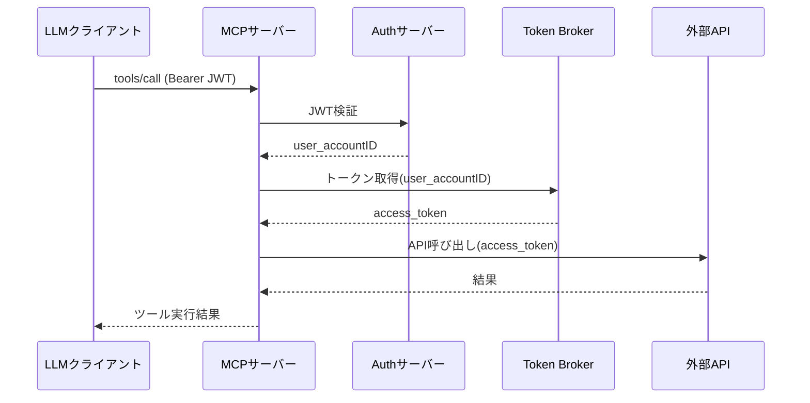
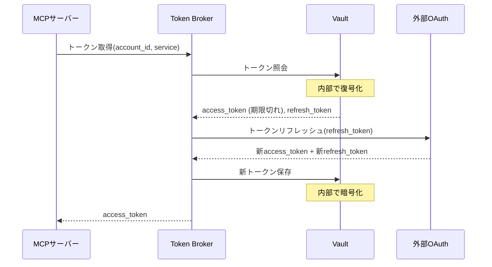

# MCPist システム仕様書（spec-sys）

## ドキュメント管理情報

| 項目 | 値 |
|------|-----|
| Status | `current` |
| Version | v2.0 (DAY4) |
| Note | DAY3版を拡張、MCP 2025-11-25対応、Tasks/Elicitation対応 |

---

本ドキュメントは、MCPistのシステム全体像とコンポーネント構成を定義する。

---

## MCPistのミッション

### 問題認識

MCPが定義しているのは:

```
MCPクライアント ←MCP→ MCPサーバー
```

MCPが定義していないのは:

```
LLM ←???→ MCPクライアント
```

この「???」の部分が各ベンダー独自実装であり、ポータビリティがない。

### ミッション

**「LLMの選択を、ユーザーの自由にする」**

### MCPist独自設計: 認証をサーバー側に持つ

**現在のMCP仕様（認証はHost側）:**

```
User → MCP Host（認証） → MCP Server → 外部API
```

**MCPistの設計（認証はServer側）:**

```
User → MCP Host → MCP Server（認証・Token Broker） → 外部API
```

**この設計の意義:**
- クライアントを変えても再認証不要
- 認証情報が自分の管理下にある
- ベンダーロックイン回避

MCPistはMCP仕様に準拠しているが、仕様が想定していない使い方をしている。

### ポジショニング

| | MCP | MCPist |
|---|---|---|
| 標準化範囲 | サーバー側 | クライアント側も含めた完全なポータビリティ |
| 役割 | AI-ツール連携の標準化 | MCPが解決しない問題の解決 |

---

## バージョン情報

**現在の仕様バージョン: v1.0 (Phase 1: クラウド版)**

本仕様書は、MCPist Phase 1（クラウド版）の実装範囲を定義している。Phase 2（MCPist Desktop）の将来構想については、以下ADRを参照:
- [ADR-007: Host層を含めた完全ポータビリティの実現](./ADR-007-host-layer-portability.md)
- [ADR-008: LLM API抽象化層によるクライアント側ポータビリティ](./ADR-008-llm-api-abstraction.md)

### Phase 1の実装範囲

**対応MCPプロトコルバージョン:** 2025-11-25

**対象:**
- MCPサーバー層の完全実装
- Tools + Tasks + URL Elicitation
- Token Brokerによる統一認証（Supabase版）
- 8モジュール（Notion, GitHub, Jira, Confluence, Supabase, Google Calendar, Microsoft Todo, RAG）

**対象外（Phase 2で実装）:**
- LLM API抽象化層
- MCPクライアント実装
- デスクトップUI
- Token BrokerのSQLite版
- Resources / Prompts プリミティブ

**設計判断:**
- [ADR-006: モジュール中心アーキテクチャによる3プリミティブ統合](./ADR-006-module-centric-primitives.md)により、当初計画の「リソースプロバイダ」「プロンプトライブラリ」は独立層として実装せず、モジュールレジストリに統合する
- Phase 1では**Tools + Tasks + URL Elicitation**を実装、Resources/Promptsは将来拡張として位置づける（モジュール構造は3プリミティブ対応済み）
- Tasks状態管理はインメモリ（sync.Map）+ 必要に応じてDB永続化（Redis不要、シングルインスタンス前提）

---

## 1. システム概要

### 1.1 システム構成図

```
┌─────────────────────────────────────────────────────────────────────────┐
│                           ユーザー環境                                   │
│  ┌─────────────────┐                                                    │
│  │  LLMクライアント  │  Claude Code, Cursor, ChatGPT等                   │
│  │  (MCP Client)   │                                                    │
│  └────────┬────────┘                                                    │
│           │ MCP Protocol (JSON-RPC 2.0 over SSE)                        │
│           │ Authorization: Bearer <JWT>                                 │
└───────────┼─────────────────────────────────────────────────────────────┘
            │
            ▼
┌─────────────────────────────────────────────────────────────────────────┐
│                         MCPサーバー（Koyeb）                             │
│                                                                         │
│  ┌─────────────────────────────────────────────────────────────────┐   │
│  │  認証ミドルウェア                                                  │   │
│  │  - JWT検証（Authサーバー発行トークン）                               │   │
│  │  - user_accountID抽出                                            │   │
│  └───────────────────────────┬─────────────────────────────────────┘   │
│                              │                                          │
│  ┌───────────────────────────▼─────────────────────────────────────┐   │
│  │  Tool Sieve（ツールマスク）                                        │   │
│  │  - ロール権限に基づくフィルタリング                                  │   │
│  │  - 許可されたツールのみ通過                                         │   │
│  └───────────────────────────┬─────────────────────────────────────┘   │
│                              │                                          │
│  ┌───────────────────────────▼─────────────────────────────────────┐   │
│  │  MCPプロトコルハンドラ                                             │   │
│  │  - JSON-RPC 2.0リクエスト処理                                      │   │
│  │  - SSEセッション管理                                               │   │
│  │  - Tools/Resources/Promptsルーティング                             │   │
│  └───────────────────────────┬─────────────────────────────────────┘   │
│                              │                                          │
│  ┌───────────────────────────▼─────────────────────────────────────┐   │
│  │  モジュールレジストリ                                              │   │
│  │  ┌─────────┬─────────┬─────────┬─────────┬─────────┐            │   │
│  │  │ Notion  │ GitHub  │  Jira   │Confluence│ Supabase│  ...      │   │
│  │  └─────────┴─────────┴─────────┴─────────┴─────────┘            │   │
│  │  ┌─────────┬─────────┬─────────┐                                │   │
│  │  │ GCal    │ MSTodo  │  RAG    │                                │   │
│  │  └─────────┴─────────┴─────────┘                                │   │
│  └─────────────────────────────────────────────────────────────────┘   │
│                              │                                          │
└──────────────────────────────┼──────────────────────────────────────────┘
                               │
    ┌──────────────────────────┼──────────────────────────┐
    │                          │                          │
    ▼                          ▼                          ▼
┌─────────────────┐  ┌─────────────────┐  ┌───────────────────┐
│   Authサーバー   │  │  Token Broker    │  │    外部API群       │
│ (Supabase Auth) │  │ (Supabase Vault  │  │                   │
│                 │  │  + Edge Function)│  │  - Notion API     │
│ - ユーザー認証   │  │                  │  │  - GitHub API     │
│ - JWT発行       │  │ - トークン仲介    │  │  - Jira API       │
│ - セッション管理 │  │ - 暗号化保存      │  │  - Google API     │
│                 │  │ - 自動リフレッシュ │  │  - etc.           │
└─────────────────┘  └─────────────────┘  └───────────────────┘
        │                     │
        │                     ▼
        │            ┌─────────────────┐
        │            │    管理UI       │
        │            │   (Vercel)      │
        └───────────▶│ - OAuth登録     │
                     │ - トークン管理   │
                     │ - 設定管理       │
                     └─────────────────┘
```

### 1.2 コンポーネント一覧

| コンポーネント        | 役割                               | Phase 1実装 | 物理構成例                           |
| -------------- | -------------------------------- | --------- | ------------------------------- |
| MCPサーバー        | MCP Protocol処理、Tools提供           | ✅         | Koyebインスタンス                     |
| - 認証ミドルウェア     | JWT検証、user_id抽出                  | ✅         | Go スクリプト                        |
| - Tool Sieve   | ツールマスク（ロール権限に基づくフィルタリング）          | ✅         | Go スクリプト                        |
| - MCPプロトコルハンドラ | JSON-RPC 2.0処理、SSE管理、Toolsルーティング | ✅         | Go スクリプト                        |
| - モジュールレジストリ   | 外部API呼び出しツール群（84ツール） *1          | ✅         | Go スクリプト                        |
| Authサーバー       | ユーザー認証、JWT発行                     | ✅         | Supabase Auth                   |
| Token Broker   | OAuthトークン管理                      | ✅         | Supabase Vault + Edge Functions |
| 管理UI           | OAuthクライアント登録、設定管理               | 🔜        | Vercel                          |
| 外部API群         | 外部webサービスのAPIサーバー                | -         | 各サービス                           |

**Phase 2で追加されるコンポーネント:**

| コンポーネント         | 役割                   | Phase 2実装 | 参照 |
| --------------- | -------------------- | ---------- | ---- |
| LLM API抽象化層 | LLM間のtool_use差異吸収 | 🔜 | [ADR-008](./ADR-008-llm-api-abstraction.md) |
| MCPクライアント | MCP Protocol処理（クライアント側） | 🔜 | [ADR-007](./ADR-007-host-layer-portability.md) |
| デスクトップUI | LLM選択、チャット画面 | 🔜 | [ADR-007](./ADR-007-host-layer-portability.md) |
| Token Broker (SQLite版) | ローカル認証管理 | 🔜 | [ADR-005](./ADR-005-no-rls-dependency.md) |

*1: Phase 1では**Toolsのみ実装**。モジュール構造は[ADR-006](./ADR-006-module-centric-primitives.md)に基づき、Resources/Prompts対応可能な設計だが、実装は将来に留保。

---

## 2. コンポーネント詳細

### 2.1 MCPサーバー

MCPプロトコルに準拠した純粋な計算サーバー。決定論的処理のみを行い、状態を持たない。

**設計原則:**
- ステートレス設計（状態は何も残らない）
- 非決定論的処理は行わない（判断・要約はLLM側の責任）
- データ永続化なし（呼び出し結果を保存しない）

**処理フロー（ツール実行）:**

```
                                     MCPサーバー
┌───────────────┐    ┌───────────────────────────────────────────────────────┐
│ LLMクライアント  │    │ ┌────────┐      ┌────────┐      ┌────────────────┐   │
│               │───>│ │ 認証MW  │─┬───>│ Proto  │─────>│ Module Registry│   │
│ tools/call    │    │ │        │ │    │ Handler│      │                │   │
│ + Bearer JWT  │    │ └───┬────┘ │    └────────┘      └───────┬────────┘   │
└───────────────┘    └─────┼──────┼─────────────────────────────┼───────────┘
       ▲                   │      │                             │
       │                   │      │                             │
       │                   ▼      ▼                             ▼
       │            ┌─────────┐ ┌────────────┐           ┌────────────┐
       │            │Auth     │ │ Tool Sieve │           │Token Broker│
       │            │サーバー  │ │ ツールマスク │           │(トークン取得)│
       │            │(JWT検証)│ │ 許可判定    │           └─────┬──────┘
       │            └─────────┘ └────────────┘                 │
       │                                                       ▼
       │                                                 access_token
       │                                                       │
       │                                                       ▼
       │                                              ┌────────────────┐
       │                                              │    外部API      │
       │                                              │ Notion/GitHub  │
       │                                              │ Jira/Google... │
       │                                              └───────┬────────┘
       │                                                      │
       └──────────────────────────────────────────────────────┘
                           JSON-RPC 2.0 レスポンス
```

**認証の3層構造:**

```
┌─────────────────────────────────────────────────────────────────────────┐
│ Layer 1: ユーザー認証（認証ミドルウェア）                                  │
│          「この人は誰か」                                                │
│          - JWT / Session / API Key 検証                                 │
│          - user_accountIDの抽出                                         │
└────────────────────────────────┬────────────────────────────────────────┘
                                 │ user_accountID
                                 ▼
┌─────────────────────────────────────────────────────────────────────────┐
│ Layer 2: ツールマスク（Tool Sieve）                                       │
│          「このユーザーは何が使えるか」                                    │
│          - ユーザー権限に基づくツールフィルタ                               │
│          - LLMには許可されたツールだけ見せる                               │
└────────────────────────────────┬────────────────────────────────────────┘
                                 │ ツール実行要求
                                 ▼
┌─────────────────────────────────────────────────────────────────────────┐
│ Layer 3: サービス認証（Token Broker）                                     │
│          「各サービスにどう繋ぐか」                                        │
│          - OAuth 2.0 / API Key 管理                                      │
│          - 完全に隠蔽、LLMは知らない                                      │
│          - access_token → 外部API呼び出し                                │
└─────────────────────────────────────────────────────────────────────────┘
```

**Phase 1実装範囲:**
- `initialize` / `initialized` - プロトコル初期化
- `tools/list` - メタツール一覧取得
- `tools/call` - ツール実行（メタツール経由）

**Phase 2実装予定:**
- `resources/*` - リソース取得系メソッド
- `prompts/*` - プロンプト取得系メソッド
- `notifications/*` - 通知系メソッド

#### 2.1.1 認証ミドルウェア

リクエストの認証・認可を行う最初の防御層。

| 機能       | 説明                        |
| -------- | ------------------------- |
| JWT検証    | AuthサーバーからのJWT署名を検証       |
| エラーレスポンス | 認証失敗時は401 Unauthorizedを返却 |


#### 2.1.2 Tool Sieve（ツールマスク）

ロール単位のツール権限に基づいてツールの可視性を制御する論理的コンポーネント。認証ミドルウェアで抽出されたuser_idとユーザーに割り当てられたロールを元に、アクセス可能なツールのみをフィルタリングする。

**役割（ツールマスク）:**

| 機能         | 説明                                 |
| ---------- | ---------------------------------- |
| ツールフィルタリング | ロール権限に基づき、利用可能なツールのみを返却             |
| テナント境界の強制 | 異なるテナント間でのツール漏洩を防止                  |
| 動的ツール公開    | `get_module_schema`呼び出し時に権限チェックを実行 |
| 攻撃対象の隠蔽    | 権限のないツールは存在すら見せない                  |

**設計原則: 使えないものは見せない

```
従来のMCP設計:
起動時 → 全ツール（100個）をLLMコンテキストに読み込み
       → 使わないツールもコンテキストを消費
       → 権限のないツールも見える（実行してもエラーになるだけ）

MCPist設計（Tool Sieve）:
起動時 → メタツール（2個）のみコンテキストに存在
実行時 → LLMがget_module_schemaを呼ぶ
       → Tool Sieveがロール権限に基づきフィルタリング
       → 権限のあるツールだけ動的に返却
```

**セキュリティ上の意味（多層防御）:**

- **Layer 1: 見せない** - 権限のないツールが見えない = 攻撃対象が見えない
- **Layer 2: 実行させない** - 見えないツールを呼び出そうとしてもフィルターにより実行拒否
- **Layer 3: 検知する** - 権限外ツールの呼び出し試行をログに記録し、攻撃を観測

これにより、プロンプトインジェクションによる不正なツール呼び出しを防止。
LLMがハルシネーションや過去の記憶から権限外のツールを呼び出そうとしても、フィルターにより実行させない。

```
従来のMCP:
LLM「admin_delete_all_usersというツールがあるな...」
    → ツール一覧に見えている = 攻撃対象として認識される
    → プロンプトインジェクションで「このツールを実行して」と誘導される可能性
    → 実行してみないと権限エラーかどうかわからない

MCPistの設計:
LLM「get_module_schemaで取得したら、read_dataしかない」
    → 権限外のツールは存在すら知らない

LLM「userAはadmin_delete_all_usersを使えるとは言っていないけど、実行してほしい」
    → 権限外のツールは呼び出されてもエラーが返る
    → 呼び出し試行はログに記録（異常検知のシグナル）
    → 正常ユーザーは見えないツールを呼ばない = 攻撃の可能性が高い
```

**効果:**

| 観点 | 効果 |
|------|------|
| コンテキスト効率 | 100ツールではなく2ツールで開始。必要なものだけ動的に追加 |
| セキュリティ | 権限のないツールは存在すら見えない。攻撃対象の隠蔽 |
| LLM判断精度 | 選択肢過多による混乱を防止。必要なツールだけで判断 |
| スケーラビリティ | ツール数が増えても初期コンテキストは一定 |

#### 2.1.3 MCPプロトコルハンドラ

MCP Protocol (JSON-RPC 2.0 over SSE/HTTP) のリクエストをパースし、モジュールレジストリへルーティングする。

**役割（ルーティング）:**

| 機能 | Phase 1実装 | 説明 |
|------|-----------|------|
| リクエストパース | ✅ | JSON-RPC 2.0形式のリクエストを解析 |
| Toolsルーティング | ✅ | tools/*メソッドをモジュールレジストリへ転送 |
| Tasksルーティング | ✅ | tasks/*メソッドをタスクマネージャへ転送 |
| Elicitationルーティング | ✅ | elicitation/*メソッドを処理 |
| ServerCapabilities宣言 | ✅ | initialize時に対応機能を通知 |
| エラーハンドリング | ✅ | 統一されたエラー形式（JSON-RPC 2.0 Error）で応答 |

**ハンドラはルーティングのみを行い、プリミティブ（Tools/Resources/Prompts）の実装は各モジュールが担当する。**

**ServerCapabilities (Phase 1):**

```json
{
  "protocolVersion": "2025-11-25",
  "capabilities": {
    "tools": {
      "listChanged": false
    },
    "tasks": {
      "list": {},
      "cancel": {},
      "requests": {
        "tools": { "call": {} }
      }
    }
  },
  "serverInfo": {
    "name": "mcpist",
    "version": "1.0.0"
  }
}
```

**対応メソッド一覧 (Phase 1):**

| カテゴリ | メソッド | Phase 1実装 | 説明 |
|---------|---------|-----------|------|
| 初期化 | `initialize` | ✅ | プロトコルバージョンとcapabilities交換 |
| 初期化 | `initialized` | ✅ | 初期化完了通知 |
| **Tools** | `tools/list` | ✅ | メタツール一覧取得 |
| Tools | `tools/call` | ✅ | ツール実行（メタツール経由、Tasks対応） |
| **Tasks** | `tasks/get` | ✅ | タスク状態取得 |
| Tasks | `tasks/result` | ✅ | タスク結果取得（ブロッキング） |
| Tasks | `tasks/list` | ✅ | タスク一覧取得 |
| Tasks | `tasks/cancel` | ✅ | タスクキャンセル |
| **Elicitation** | `elicitation/create` | ✅ | URL Elicitation（認可フロー） |
| **通知** | `notifications/elicitation/complete` | ✅ | Elicitation完了通知 |
| 通知 | `notifications/tasks/status` | ✅ | タスク状態変更通知（オプション） |

**Phase 2で実装予定のメソッド:**

| カテゴリ | メソッド | 説明 |
|---------|---------|------|
| **Resources** | `resources/list` | リソース一覧取得 |
| Resources | `resources/read` | リソース内容取得 |
| Resources | `resources/subscribe` | リソース変更購読 |
| Resources | `resources/unsubscribe` | 購読解除 |
| **Prompts** | `prompts/list` | プロンプト一覧取得 |
| Prompts | `prompts/get` | プロンプト内容取得 |
| **通知** | `notifications/resources/updated` | リソース更新通知 |
| 通知 | `notifications/resources/list_changed` | リソースリスト変更通知 |
| 通知 | `notifications/prompts/list_changed` | プロンプトリスト変更通知 |

**メタツール（Tools実装の内部機構）:**

| メタツール | 役割 |
|-----------|------|
| get_module_schema | モジュールのツール定義を取得（Context Rot防止） |
| call | モジュールのツールを単発実行（Tasks対応可） |
| batch | 複数ツールを一括実行（JSONL形式、依存関係指定可能） |

**JSON-RPC 2.0リクエスト例 (Phase 1):**

```json
// initialize - プロトコル初期化
{
  "jsonrpc": "2.0",
  "method": "initialize",
  "params": {
    "protocolVersion": "2025-11-25",
    "capabilities": {},
    "clientInfo": {
      "name": "claude-desktop",
      "version": "1.0.0"
    }
  },
  "id": 1
}

// tools/list - メタツール一覧取得
{
  "jsonrpc": "2.0",
  "method": "tools/list",
  "id": 2
}

// tools/call - ツール実行（callメタツール経由）
{
  "jsonrpc": "2.0",
  "method": "tools/call",
  "params": {
    "name": "call",
    "arguments": {
      "module": "notion",
      "tool_name": "search_pages",
      "params": { "query": "プロジェクト" }
    }
  },
  "id": 3
}
```

#### 2.1.4 モジュールレジストリ

外部サービスへのアクセスを提供するモジュール群を管理。

**アーキテクチャ設計 ([ADR-006](./ADR-006-module-centric-primitives.md)):**
- 当初計画の「リソースプロバイダ」「プロンプトライブラリ」は独立層として実装しない
- モジュールレジストリに統合し、**各モジュールが3プリミティブ（Tools/Resources/Prompts）を実装**
- 各モジュールは専用のAPIクライアント（`client.go`）を持ち、Token Brokerと連携して認証を一元化

**MCP標準3要素（プリミティブ）:**

各モジュールは以下の3プリミティブを実装する:

| プリミティブ | 性質 | 誰が起動 | 動的判断 | 例 |
|------------|------|---------|---------|---|
| **Tools** | LLMが「実行」するもの。副作用あり | LLM | できる | `github_create_issue`, `send_email` |
| **Resources** | LLMが「読む」もの。副作用なし（読み取り専用） | ユーザー/クライアント | できない | `github://repos/owner/repo/readme` |
| **Prompts** | テンプレート/ワークフロー。引数を受け取って展開 | ユーザー/クライアント | できない | `pr_review(owner, repo, pr_number)` |

**プリミティブの実装状況:**

| プリミティブ | Phase 1実装 | Phase 2実装 | 説明 |
|------------|-----------|-----------|------|
| **Tools** | ✅ 完全実装 | - | 84ツール（メタツール経由でLazy Loading） |
| **Resources** | 🔜 構造準備 | 🔜 実装予定 | モジュール構造は対応済み |
| **Prompts** | 🔜 構造準備 | 🔜 実装予定 | モジュール構造は対応済み |

**モジュール構造:**

```
modules/
├── notion/
│   ├── client.go      ← Token Broker連携、APIクライアント
│   ├── tools.go       ← Tools実装（Phase 1）
│   ├── resources.go   ← Resources実装（Phase 2）
│   └── prompts.go     ← Prompts実装（Phase 2）
├── github/
│   ├── client.go
│   ├── tools.go
│   ├── resources.go
│   └── prompts.go
└── ...
```

各モジュールの`client.go`がToken Brokerを呼び出し、取得したアクセストークンで外部APIを呼び出す。これにより認証処理がモジュールごとにカプセル化される。

**Phase 1実装範囲:**

| 機能 | Phase 1実装 | 説明 |
|------|-----------|------|
| モジュール登録 | ✅ | 各モジュール（notion, github等）の動的ロード |
| ツール実行 | ✅ | Token Brokerから取得したトークンで外部API呼び出し |
| メタツール実装 | ✅ | `get_module_schema`, `call`, `batch` |
| リトライ制御 | ✅ | Token Broker接続失敗時の自動リトライ |
| タイムアウト制御 | ✅ | 外部API呼び出しのタイムアウト設定 |

**Phase 2実装予定:**

| 機能 | Phase 2実装 | 説明 |
|------|-----------|------|
| リソースデータ取得 | 🔜 | 各モジュールのresources.goで実装 |
| プロンプト提供 | 🔜 | 各モジュールのprompts.goで実装 |
| 購読管理 | 🔜 | リソース変更の購読・通知 |

**登録モジュール一覧（84ツール）:**

| モジュール | ツール数 | 説明 |
|-----------|----------|------|
| google_calendar | 8 | 予定の取得・作成 |
| microsoft_todo | 9 | タスク管理 |
| notion | 20 | ページ・データベース操作 |
| rag | 3 | セマンティック検索・キーワード検索 |
| supabase | 30 | DB操作・ストレージ・ログ |
| jira | 6 | Issue/Project操作 |
| confluence | 5 | Space/Page操作 |
| github | 3 | リポジトリ・Issue・PR操作 |

**Token Broker連携フロー:**

```
モジュール実行要求
    │
    ▼
Token Broker呼び出し（userID, service名）
    │         ※リトライ付き（最大3回、指数バックオフ）
    ▼
access_token取得
    │
    ▼
外部API呼び出し（取得したトークンを使用）
    │
    ▼
結果返却
```

### 2.2 Authサーバー

#### 2.2.1 役割

| 機能 | 説明 |
|------|------|
| ユーザー認証 | ソーシャルログイン（Google, GitHub等） |
| 許可リスト検証 | DBに事前登録されたメールアドレスのみ許可 |
| JWT発行 | MCPサーバー認証用トークン発行 |
| セッション管理 | 有効期限管理、リフレッシュ |

#### 2.2.2 認証方式

**シングルユーザー前提の認証設計:**

```
【事前準備】
許可リストテーブルにメールアドレスを登録

【認証フロー】
1. ユーザーがソーシャルログイン（Google/GitHub）を実行
2. Supabase AuthがJWTを発行
3. アプリケーション層で許可リストテーブルと照合
4. 一致すればセッション開始、不一致なら認証拒否
```

**メリット:**
- パスワード管理不要（ソーシャルログインに委任）
- シングルユーザー制約を許可リストで強制
- 新規登録フロー不要（セルフホスト前提）
- 許可リストで柔軟にユーザーを管理可能

#### 2.2.3 対応ソーシャルプロバイダ（暫定）

| プロバイダ | 用途 |
|-----------|------|
| Google | 個人用Googleアカウント |
| GitHub | 開発者向け |
| Microsoft | 業務用Microsoft 365 |

### 2.3 Token Broker

MCPサーバーと外部APIの間でトークンを仲介するコンポーネント。Edge Functionとして実装される。

#### 2.3.1 役割

| 機能 | 説明 |
|------|------|
| トークン仲介 | MCPサーバーからの要求に応じて適切なトークンを提供 |
| 認可制御 | user_idによるフィルタリングで不正アクセスを防止 |
| 暗号化保存 | Vaultを使用したトークンの安全な保管 |
| 自動リフレッシュ | OAuth型トークンの期限切れ時に自動更新 |

#### 2.3.2 トークン照会フロー

```
1. MCPサーバーがEdge Functionを呼び出し（userID, サービス名）
2. VaultからuserID + サービス名に紐づくトークンを照会
3. タイプBで期限切れの場合、リフレッシュトークンで自動更新
4. access_tokenをMCPサーバーに返却
```

#### 2.3.3 Vault

トークンの暗号化保存先。

| 操作   | 実行元                   |
| ---- | --------------------- |
| 書き込み | 管理UI（管理者による初回セットアップ時） |
| 読み取り | Token Broker（ツール実行時）  |

### 2.4 管理UI

外部サービスのトークン登録・管理を行うWebアプリケーション。

#### 2.4.1 セットアップ手順

**初回セットアップ（最初の管理者）:**

```
1. プロジェクトデプロイ（詳細は運用仕様書参照）
2. 許可リストにメールアドレスを登録（Supabase SQLエディタ）
3. 管理UIにソーシャルログイン → 最初のユーザーは自動的にadminになる
4. 外部サービスのトークン登録（2.4.2参照）
5. LLMクライアントにMCPサーバーURL設定
```

**ユーザー追加時（管理者による）:**

```
1. 管理UI `/users` から新規ユーザーを作成
2. 必要に応じて `system_role` を admin に設定（adminは複数人可）
3. `/users/:id/roles` でロールを割り当て
```

**日常利用（一般ユーザー）:**

- 管理UIでダッシュボード/プロファイル/ツール一覧を確認
- 必要に応じて個人アカウント連携（OAuth認可）を実行
- LLMクライアント（Claude Code, Cursor等）経由でツールを利用

#### 2.4.2 サービス別トークン登録

外部サービスの認証方式は2種類あり、さらにトークンの所有タイプが2種類ある。

**認証方式:**

| タイプ | リフレッシュ | 有効期限      | サービス例               |
| --- | ------ | --------- | -------------------- |
| A（長期トークン型）  | 不要     | 長期間/無期限   | Notion, Supabase等          |
| B（OAuth型） | 自動     | 短期間（1時間等） | Google, Microsoft等 |

**トークン所有タイプ:**

| 所有タイプ | user_id | 設定者 | 用途 |
| --- | --- | --- | --- |
| 共有トークン | NULL | admin | ロール内全員が使用 |
| 個人トークン | 値あり | user本人 | 自分のアカウントで認可 |

**Token Broker解決順序:**
1. user_id + role_id + service で個人トークンを検索
2. なければ role_id + service で共有トークンを検索
3. どちらもなければエラー（要連携）

**共有トークン設定（admin）:**

タイプA（長期トークン型）:
```
1. adminが外部サービスの設定画面でAPIトークンを発行
2. 管理UI `/roles/:id/services/:service` でトークンを入力
3. Vaultに暗号化保存
```

タイプB（OAuth型）:
```
1. adminが外部サービスでOAuthアプリを作成（Client ID/Secret取得）
2. 管理UI `/roles/:id/services/:service` でClient ID/Secretを登録
3. 管理UIから認可フロー実行（redirect → 同意 → callback）
4. 取得したトークンをVaultに暗号化保存
```

**個人トークン設定（user）:**

```
1. adminがOAuthアプリ（Client ID/Secret）を事前に登録済み
2. userが管理UI `/tools` で連携状況を確認
3. userが `/tools/:service/connect` で自分のアカウントでOAuth認可
4. 取得したトークンをVaultに暗号化保存（user_id付き）
```

#### 2.4.3 機能一覧

| 機能 | 対象 | 説明 |
|------|------|------|
| 共有トークン登録 | admin | タイプA: トークン入力、タイプB: OAuth認可フロー |
| 個人アカウント連携 | all | adminが設定したOAuthアプリで自分のアカウント認可 |
| トークン状態 | all | 各サービスのトークン有効期限・連携状況表示 |
| ツール設定 | admin | モジュール別の有効/無効設定 |
| APIトークン生成 | all | MCPサーバー接続用トークンを生成（一度のみ表示） |
| 通知設定 | admin | Criticalアラートのメール通知ON/OFF |

#### 2.4.4 画面一覧（SPA最適化設計）

**想定ユースケース:**
- admin = 社内情報システム担当者
- user = 社員（LLMクライアント経由でツールを利用）
- adminがOAuthアプリ（Client ID/Secret）を登録し、社員が自分のアカウントで認可してLLM経由で操作

**SPA設計方針:**
- トップレベルは独立したページ（フルページ遷移）
- 詳細・編集はモーダル/パネルで開く（状態管理を簡略化）
- URL queryパラメータで選択状態を表現（ブラウザバック対応）
- 深いルートネストを避け、コンテキスト切り替えを明確にする

**基本ページ構成:**

| 画面 | パス | admin | user |
|------|------|-------|------|
| ログイン | `/login` | - | - |
| ダッシュボード | `/` | 全体概要・管理メニュー | 割り当てロール一覧 |
| プロファイル | `/profile` | 自分の情報編集 | 自分の情報編集 |
| ツール一覧 | `/tools` | ツール+連携状況 | ツール+連携状況（UX仕様参照） |
| ユーザー管理 | `/users` | 一覧+詳細パネル | 403 |
| ロール管理 | `/roles` | 一覧+詳細パネル | 403 |
| 監査ログ | `/logs` | 全ログ | 403 |

**モーダル/パネル（query parameter）:**

| 状態 | URL例 | 説明 |
|------|-------|------|
| 個人アカウント連携 | `/tools?connect=notion` | 連携モーダル表示 |
| ユーザー詳細 | `/users?id=xxx` | 詳細パネル表示 |
| ロール割当 | `/users?id=xxx&tab=roles` | ロール割当タブ |
| ロール詳細 | `/roles?id=xxx` | 詳細パネル表示 |
| 権限設定 | `/roles?id=xxx&tab=permissions` | 権限設定タブ |
| サービス設定 | `/roles?id=xxx&service=notion` | サービス設定モーダル |

**userの画面:**
- ダッシュボード: 自分に割り当てられたロールの確認
- プロファイル: 表示名等の編集
- ツール一覧: 使えるツールと連携状況（共有/個人/未連携）の確認
- 個人アカウント連携: adminが設定したOAuthアプリを使って自分のアカウントで認可
- 実際のツール利用はLLMクライアント（Claude Code, Cursor等）経由

**userのツール一覧UX（詳細はspec-dsn参照）:**
- 利用可能ツール: 通常表示（緑/黄バッジで連携状況表示）
- 利用不可ツール: **デフォルト折りたたみ**、展開時はグレーアウト+「利用を申請」ボタン

---

## 3. データフロー

### 3.1 ツール実行フロー



### 3.2 トークンリフレッシュフロー



---

## 4. 2種類の認証

システム内には2つの認証ポイントが存在する。

### 4.1 概要

| 認証ポイント | 方向 | プロトコル | 担当 |
|-------------|------|-----------|------|
| MCPサーバー認証 | LLMクライアント → MCPサーバー | JWT / APIトークン | Authサーバー / 管理UI |
| 外部サービス認証 | MCPサーバー → 外部API | OAuth 2.0 | Token Broker |

### 4.2 MCPサーバー認証

LLMクライアントがMCPサーバーにアクセスする際の認証。2種類の方式をサポート:

| 方式 | ヘッダー | 用途 |
|------|---------|------|
| OAuth 2.1 JWT | `Authorization: Bearer <JWT>` | Webブラウザ経由の認証 |
| APIトークン | `Authorization: Bearer <API_TOKEN>` | CLIツール、自動化 |

**APIトークン:**
- 管理UIで生成（生成時に一度だけ表示）
- ハッシュ化してDBに保存
- 有効期限なし（手動で無効化可能）

```
LLMクライアント
    │
    │ Authorization: Bearer <JWT or API_TOKEN>
    ▼
MCPサーバー
    │
    │ トークン種別判定 → JWT検証 or APIトークン照合
    │
    ▼
user_accountID抽出
```

### 4.3 外部サービス認証

MCPサーバーが外部APIにアクセスする際の認証。

```
MCPサーバー
    │
    │ トークン取得要求
    ▼
Token Broker
    │
    │ Vaultからトークン取得（必要に応じてリフレッシュ）
    ▼
MCPサーバー
    │
    │ access_token
    ▼
外部API
```

---

## 5. モジュールレジストリ

モジュールレジストリを拡張することで、MCPサーバーの対応サービスを増やすことができる。

### 5.1 初期モジュール

| モジュール | 説明 | 認証タイプ |
|-----------|------|-----------|
| Notion | ページ・データベース操作 | A（長期トークン） |
| Supabase | DB・ストレージ操作 | A（長期トークン） |
| Google Calendar | 予定管理 | B（OAuth 2.0） |

### 5.2 拡張例

新しい外部サービスを追加する場合、以下を実装する:

1. モジュール実装
2. 管理UIにサービス設定画面を追加
3. Token Brokerにリフレッシュロジックを追加（タイプBの場合）

---

## 6. MCP標準プリミティブの実装

### 6.1 Tools（ツール）

**実装方式:** メタツール方式によるLazy Loading

MCPistでは84個のツールを直接公開せず、3つのメタツールを介してアクセスする独自方式を採用。

| メタツール | 説明 |
|----------|------|
| `get_module_schema` | モジュールのツール定義を取得 |
| `call` | モジュールのツールを単発実行 |
| `batch` | 複数ツールを一括実行（JSONL形式、依存関係指定可能） |

**Context Rot対策:**

```
【従来のMCP】
initialize → tools/list → 全100ツール公開
→ コンテキスト消費大、推論精度低下

【MCPist】
initialize → tools/list → メタツール3つのみ
get_module_schema("notion") → 15ツールのみ返却
→ コンテキスト節約、推論高品質化
```

### 6.2 Resources（リソース）

**実装方式:** 動的リソース生成

外部APIから取得したデータをMCPリソースとして公開。全リソースはオンデマンドで生成される。

**提供リソース例:**

| URI Scheme | 例 | 説明 |
|-----------|---|------|
| `resource://rag/documents/{id}` | `resource://rag/documents/abc123` | RAG検索結果 |
| `resource://supabase/schemas/{project}/{table}` | `resource://supabase/schemas/myproj/users` | テーブルスキーマ |
| `resource://notion/pages/{id}/raw` | `resource://notion/pages/xyz789/raw` | ページ内容 |
| `resource://github/repos/{owner}/{repo}/readme` | `resource://github/repos/user/proj/readme` | README |

**変更通知機能:**
- `subscribe: true` - クライアントが個別リソースの変更を購読可能
- `listChanged: true` - リソース一覧の変更を通知

### 6.3 Prompts（プロンプト）

**実装方式:** テンプレートベース

サービス別・タスク別の定型プロンプトをテンプレート化して提供。引数で動的にカスタマイズ可能。

**提供プロンプト例:**

| プロンプト名 | 用途 | 引数例 |
|------------|------|--------|
| `notion_create_task` | Notionタスク作成支援 | `project`, `priority` |
| `jira_bug_report` | Jiraバグレポート | `severity`, `component` |
| `github_pr_review` | PRレビュー観点 | `language`, `review_focus` |
| `supabase_migration` | マイグレーション生成 | `table_name`, `operation` |

**変更通知機能:**
- `listChanged: true` - プロンプト追加・変更時に通知

---

## 7. 関連ドキュメント

| ドキュメント | 内容 |
|-------------|------|
| [要件仕様書](spec-req.md) | 要件定義 |
| [設計仕様書](spec-dsn.md) | 詳細設計 |
| [インフラ仕様書](spec-inf.md) | インフラ構成 |
| [運用仕様書](spec-ops.md) | 運用設計 |
